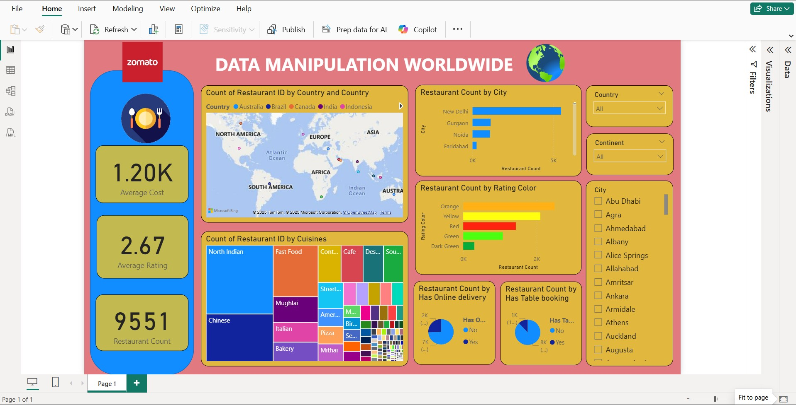

# Zomato Power BI Project

## 📌 Project Overview

This project focuses on analyzing **Zomato restaurant data** using **Power BI** with a complete workflow that includes:

* Data Import
* Power Query Transformations
* Data Modeling
* DAX Calculations
* Interactive Dashboard Creation

The goal is to uncover insights about restaurant ratings, cost, cuisine distribution, and customer preferences.

---

## 📂 Dataset Used

* **Source:** Zomato Restaurant Dataset (CSV/Excel)
* **Columns typically included:**

  * Restaurant Name
  * Location
  * Rating
  * Cuisines
  * Cost for Two
  * Votes
  * Online Order (Yes/No)
  * Table Booking (Yes/No)

---

## 🔧 Data Cleaning & Transformation (Power Query)

Performed the following steps in Power Query:

* Removed duplicates and null values
* Corrected data types (numeric, text)
* Split multi-value columns like *Cuisines*
* Trimmed and cleaned text fields
* Created calculated columns (if needed)
* Standardized location names

---

## 🏗️ Data Modeling

Designed a clean and optimized model:

* Fact table: **Restaurant Details**
* Dimension tables: **Cuisine**, **Location**, **Rating Buckets**
* Relationships created using IDs or cleaned fields

---

## 🧮 DAX Measures Used

Some of the key DAX measures created:

* **Total Restaurants**

```DAX
Total Restaurants = COUNT('Restaurants'[Restaurant Name])
```

* **Average Rating**

```DAX
Average Rating = AVERAGE('Restaurants'[Rating])
```

* **Total Votes**

```DAX
Total Votes = SUM('Restaurants'[Votes])
```

* **Average Cost for Two**

```DAX
Average Cost = AVERAGE('Restaurants'[Cost for Two])
```

* **Restaurants Offering Online Order**

```DAX
Online Order % =
DIVIDE(
    CALCULATE(COUNT('Restaurants'[Restaurant Name]), 'Restaurants'[Online Order] = "Yes"),
    [Total Restaurants]
)
```

---

## 📊 Dashboard Features

The Power BI dashboard includes:

* Ratings distribution chart
* Top cuisines by popularity
* Restaurant cost comparison
* Online order availability insights
* Location-wise restaurant count
* KPIs using DAX measures

Interactive features:

* Slicers for cuisine, rating, cost and location
* Dynamic tooltips
* Drill-through pages

---

## 📝 Key Insights Derived

* Most popular cuisines based on rating and votes
* Locations with highest-rated restaurants
* Relationship between **cost for two** and **ratings**
* Restaurant categories offering online ordering
* Consumer preference trends

---

## 📷 Dashboard Screenshots



---

## 🚀 How to Use This Repository

To explore and understand this Power BI project effectively, follow these steps:

1. **Download the `.pbix` file** directly from this repository.
2. **Open the file in Power BI Desktop** (preferably the latest version) to ensure full compatibility.
3. Navigate through the **Power Query Editor** to review all data cleaning and transformation steps.
4. Examine the **data model** to understand the structure, relationships, and dimensional design.
5. Review the **DAX measures** used for KPIs and analytical calculations.
6. Interact with the **dashboard visuals**, apply filters, and explore insights across locations, ratings, cuisines, and cost metrics.

---

## 💡 Future Improvements

This project can be enhanced further through the following improvements:

* **Advanced Analytics Integration:** Incorporating Python or R scripts within Power BI for predictive modeling and deeper statistical insights.
* **Enhanced Dimensional Modeling:** Creating fully optimized dimension tables for cuisines, locations, rating groups, and price categories.
* **Geospatial Analysis:** Using map visuals or shape maps to reveal patterns based on regions and clusters.
* **Dynamic Tooltip Pages:** Adding detailed tooltip pages to provide contextual insights on hover.
* **Time-Series Expansion:** Introducing time-based data (if available) to analyze trends over months, seasons, or years.

## 📝 Project Summary

This Zomato Power BI project provides a comprehensive analysis of restaurant data across different countries and cities. Using Power Query for data cleaning, a well‑structured data model, and advanced DAX calculations, the dashboard delivers clear insights into restaurant ratings, costs, cuisines, and customer preferences. The visualizations make it easy to understand global patterns, compare regions, and identify key culinary trends. This project demonstrates strong skills in data transformation, BI reporting, and interactive dashboard design.

---

## 👩‍💻 About This Project

This project is created as part of a data analytics portfolio showcasing skills in:

* Power BI
* Data Cleaning
* Data Modeling
* DAX Calculations
* Dashboard Design

Feel free to explore, fork, or use this project structure for learning and practice!
